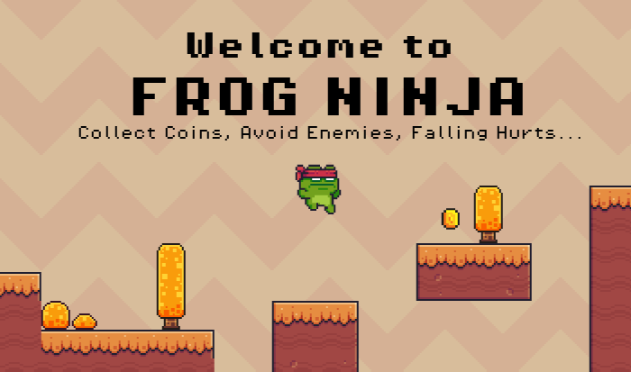

# Frog Ninja

A 2D pixel platformer built in Godot. The objective is to navigate the terrain, collect coins and dodge enemies without falling off the map.

## Tech Stack
* **Engine:** Godot 4 
* **Language:** GDScript
* **Assets:** Built using open-source pixel art.

## How to Play
1. Clone this repository.
2. Open Godot 4 and import the `project.godot` file.
3. Press `F5` to run the game locally.
